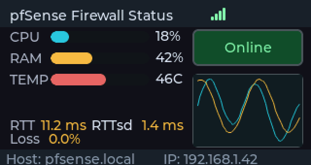
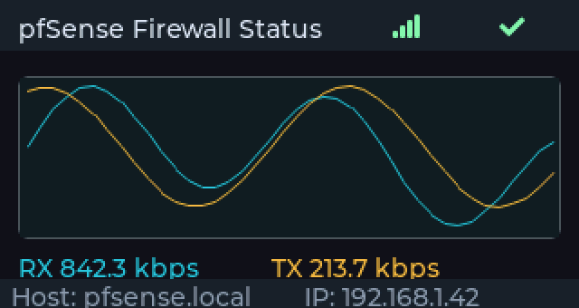
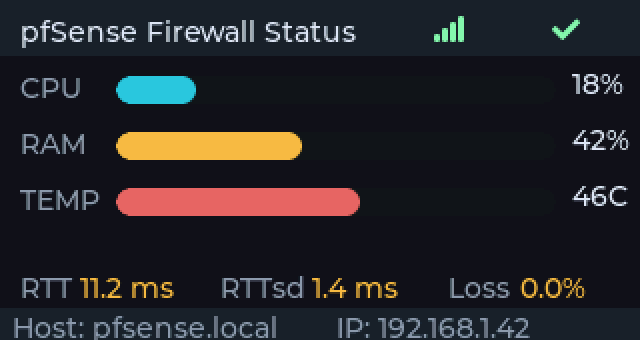

# pfsense-status-esp32

A small ESP32 dashboard that shows live pfSense WAN/gateway status, system load and traffic on a TFT display - no PC, phone or browser tab required. Configuration happens through a captive Wi-Fi portal, and firmware updates are pulled directly from this repository's GitHub releases.

Supports multiple board profiles out of the box (LilyGO T-Display S3, CYD 2.8"), so adding another display is a matter of writing one new board header, not touching the application code.

## Screenshots

The following are pixel-accurate mockups rendered from the real UI code with a native SDL2 simulator (see [tools/ui_simulator](tools/ui_simulator)), not photos - useful since the actual layout doesn't need physical hardware to preview. Cycle through them on the device with the button (see [Features](#features)).

| Dashboard | Traffic graph | Metrics |
| --- | --- | --- |
|  |  |  |
| Compact overview: CPU/RAM/temperature bars, WAN online/offline status and a mini traffic chart. | Full-width RX/TX chart for the WAN interface. | Enlarged CPU/RAM/temperature bars plus RTT, jitter (RTTsd) and packet loss. |

## Features

- Captive portal for first-time setup (AP SSID `FW-Status-AP`), password-gated web menu for subsequent access
- Wi-Fi credentials and pfSense API settings persisted in NVS (`Preferences`)
- Gateway status via the pfSense REST API (`/api/v2/status/gateways`): online/offline, round-trip time, jitter, packet loss
- CPU/RAM/temperature via the pfSense REST API (`/api/v2/status/system`)
- WAN traffic history (RX/TX) sampled from interface counters and rendered as a live chart
- Three-screen live dashboard (NerdMiner-inspired layout), cycled with a physical button; second button cycles display brightness
- Self-updating: checks this repo's GitHub releases periodically and shows an update badge; installing a release verifies the downloaded firmware's SHA256 checksum (from GitHub's release asset digest) before committing the OTA write, so a corrupted or tampered download is discarded instead of booted
- Factory reset (erase Wi-Fi + pfSense config) from the web menu

## Requirements

- A supported ESP32 board:
  - LilyGO T-Display S3 (`lilygo-t-display-s3`)
  - CYD 2.8" / 2432S028 (`cyd-2432s028`)
- [PlatformIO](https://platformio.org/) (CLI or the VS Code extension)
- pfSense with the REST API package installed
- An API key with read permissions on the gateway/system status endpoints

## Quick start

1. Pick the matching PlatformIO environment:
   - LilyGO: `lilygo-t-display-s3`
   - CYD: `cyd-2432s028`
2. Build and flash the project with PlatformIO.
3. On first boot, connect to the `FW-Status-AP` Wi-Fi network.
4. Open `192.168.4.1` in a browser.
5. Enter your home Wi-Fi credentials, the pfSense host/IP and the API key, then save.
6. The device reconnects to your network and starts showing live status data.

## Firmware updates

The device periodically checks `https://api.github.com/repos/UniqueDroid/pfsense-status-esp32/releases/latest` and shows an update badge on the dashboard when a newer tagged release is available. Triggering the update from the web menu:

1. Downloads the release's `.bin` asset over HTTPS and streams it directly into the inactive OTA partition.
2. Computes a SHA256 hash of the downloaded bytes while streaming, and compares it against the checksum GitHub reports for that asset (the release API's `digest` field).
3. Only marks the new partition bootable if the hashes match; on a mismatch, the write is discarded and the device keeps running its current firmware.

## Board profiles (Bruce-style)

- Board-specific defines live under `include/boards/`.
- The active profile is selected per PlatformIO environment via a build flag in `platformio.ini`:
  - `BOARD_PROFILE_LILYGO_T_DISPLAY_S3`
  - `BOARD_PROFILE_CYD_2432S028`
- To add a new board:
  1. Create a new profile at `include/boards/<your_board>.h`.
  2. Register it in `include/boards/board_profile.h`.
  3. Add a new environment in `platformio.ini` with the matching `BOARD_PROFILE_...` flag.

## Security notes

- The pfSense API key is only ever sent over HTTPS; if the firewall only answers on plain HTTP, the device treats that as unreachable rather than falling back to sending the key in the clear.
- TLS connections use `setInsecure()` to tolerate pfSense's typical self-signed certificate. For production use, certificate pinning would be a stronger (but more maintenance-heavy) alternative.
- The web config menu is password-gated; factory-erase and firmware-update routes are gated behind the same session check.
